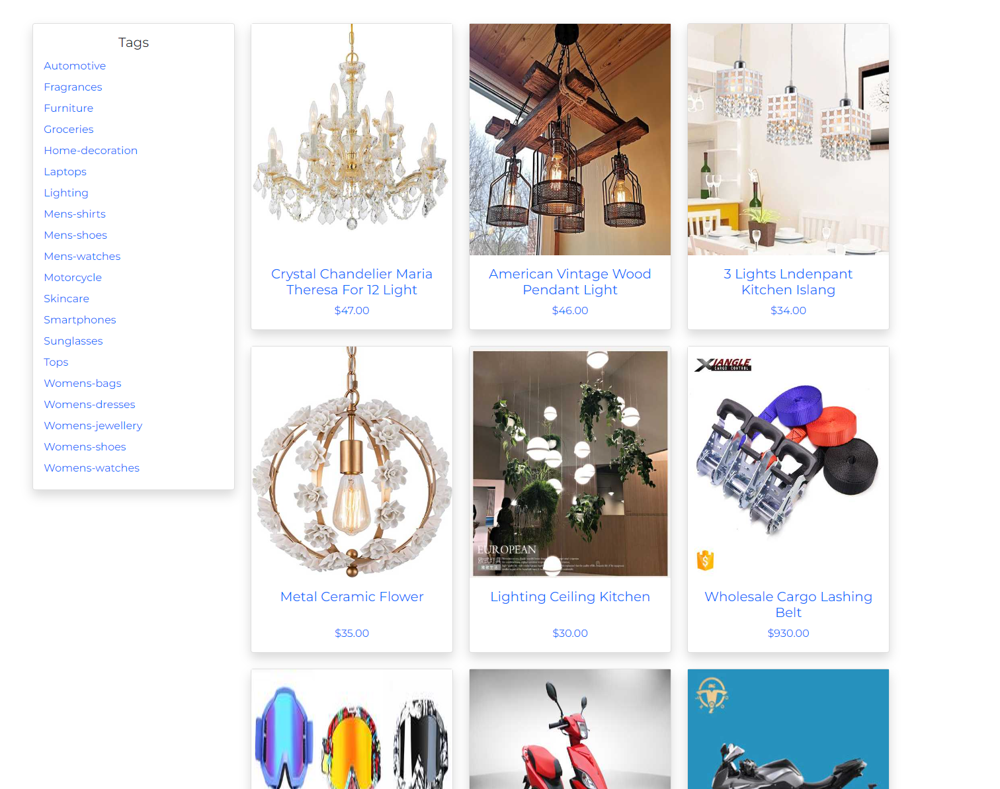
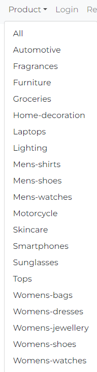
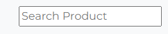
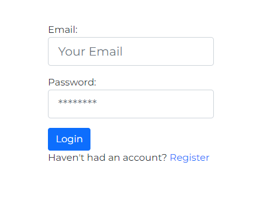
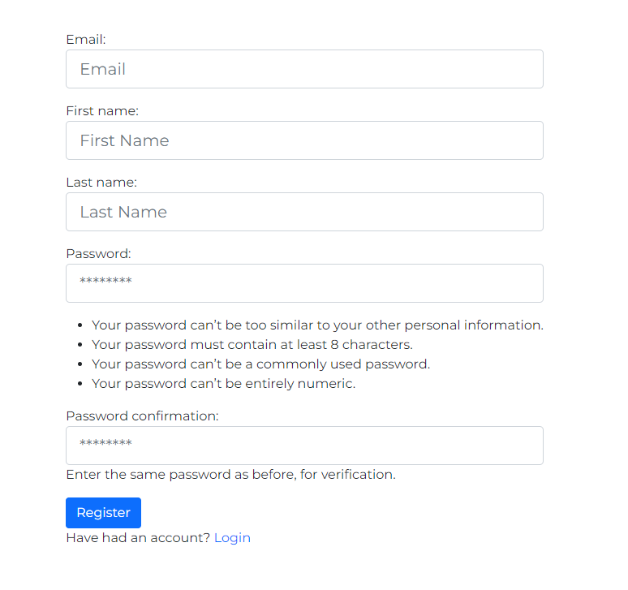
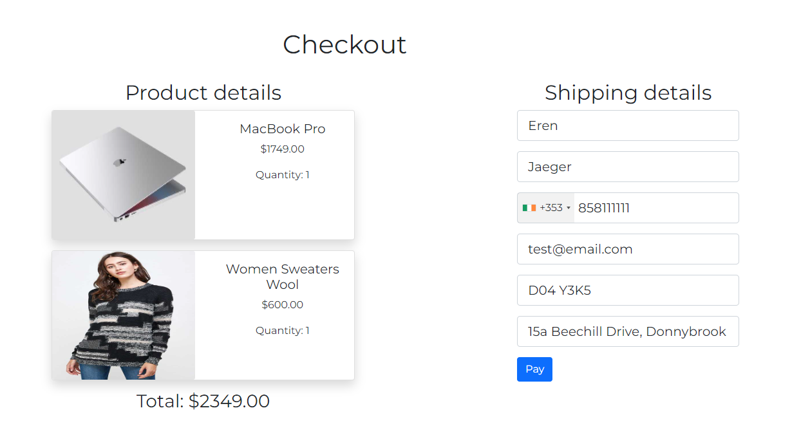
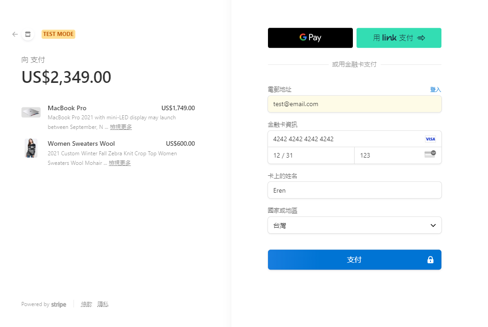
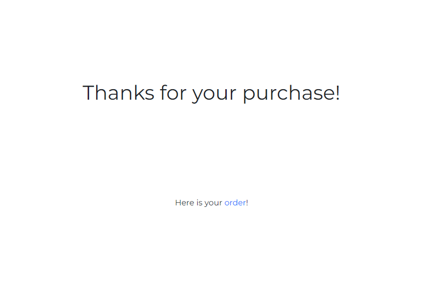
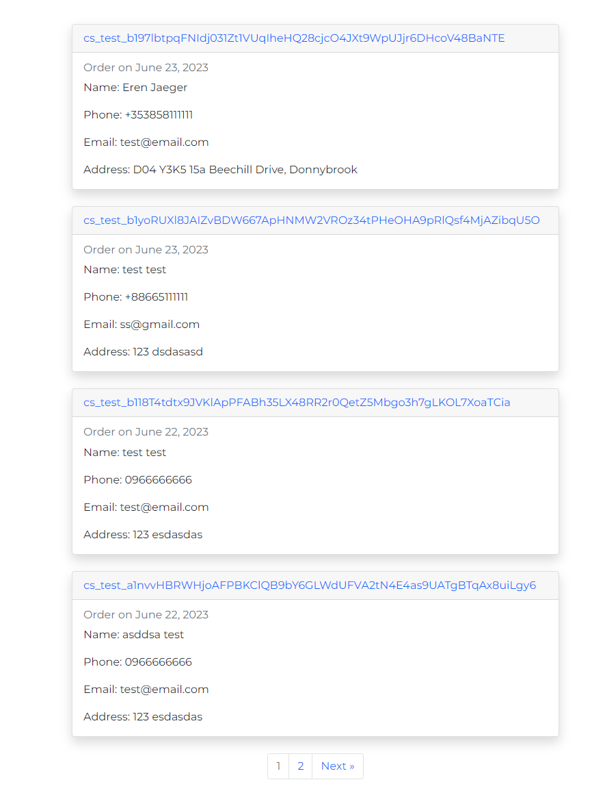
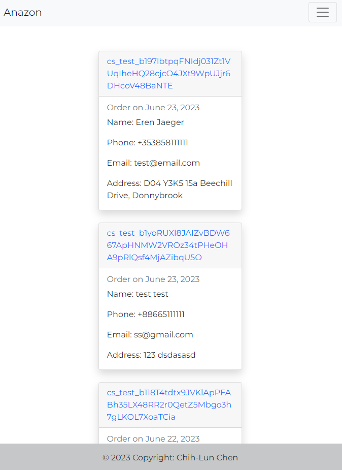

# Anazon

# What is Anazon

Anazon is a versatile e-commerce platform offering a wide range of products to fulfill your shopping desires. From luxurious fragrances to stylish furniture, cutting-edge smartphones to trendy sunglasses, Anazon has everything you need to enhance your lifestyle.

# How to start Anazon

## Install required package

1. cd anazon
2. pip install -r requirements.txt

## Configure environment variables. Package dotenv will load all them

1. cd anazon
2. touch .env
3. Add SECRET_KEY, DEBUG, STRIPE_API_KEY, STRIPE_ENDPOINT_SECRET

## Open stripe cli to listen stripe event

1. download stripe cli from https://stripe.com/docs/stripe-cli
2. stripe login
3. stripe listen --forward-to localhost:8000/stripe_webhook/

## Start Anazon

1. cd anazon
2. python manage.py runserver

# Features

## Index

## Product

- Display products with tags as filter
  

- Categories on navbar dropdown

- Product details

- Search product

## Login

## Register

## Cart

- Dropdown cart

- Cart detail

## Checkout

- Confirmation and shipping information

- Payment

- Success

## Order

- Summary

- Order detail for items

## RWD

# Technologies Used

- Programming Languages: Python
- Framework: Django
- Front-end Technologies: HTML, CSS, JavaScript
- Database: SQLite
- Version Control: Git
